# Supply Chain Control Tower Data Platform

<p align="center">
  <strong>End-to-end Data Engineering portfolio built on Microsoft WideWorldImporters.</strong><br/>
  Operational supply-chain visibility + historical analytics + realtime serving + data-quality validation.
</p>

<p align="center">
  
  
  
  
  
</p>

[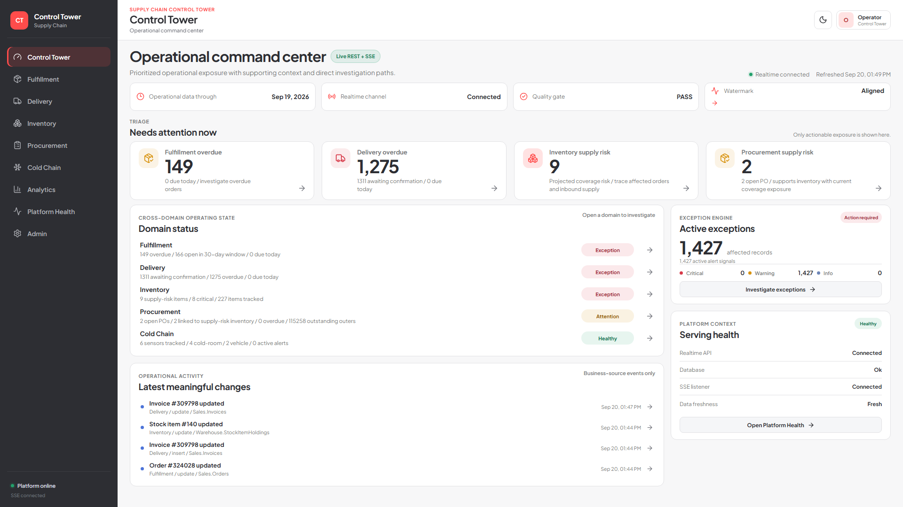](docs/demo/01-control-tower-overview.png)

## Why this project exists

Operational supply-chain teams need to answer questions such as:

- Which orders are already overdue?
- Which deliveries are still awaiting confirmation?
- Which stock items will run short before inbound supply arrives?
- Which purchase orders are supporting exposed inventory and downstream orders?
- Are cold-chain sensors healthy and fresh?
- Can every exception be traced back to source evidence?

This project turns a transactional SQL Server source into a **Control Tower for current operational action** and a **PostgreSQL/dbt warehouse for historical analysis and data reconciliation**.

The investigation model is:

```text
exception -> business impact -> evidence -> derived cause -> related records -> timeline / action
```

## Product tour

Every serving area has its own operational purpose. Click any image for the full-size view.

<table>
<tr>
<td width="33%"><strong>Fulfillment</strong><br/><a href="docs/demo/04-fulfillment-overview.png">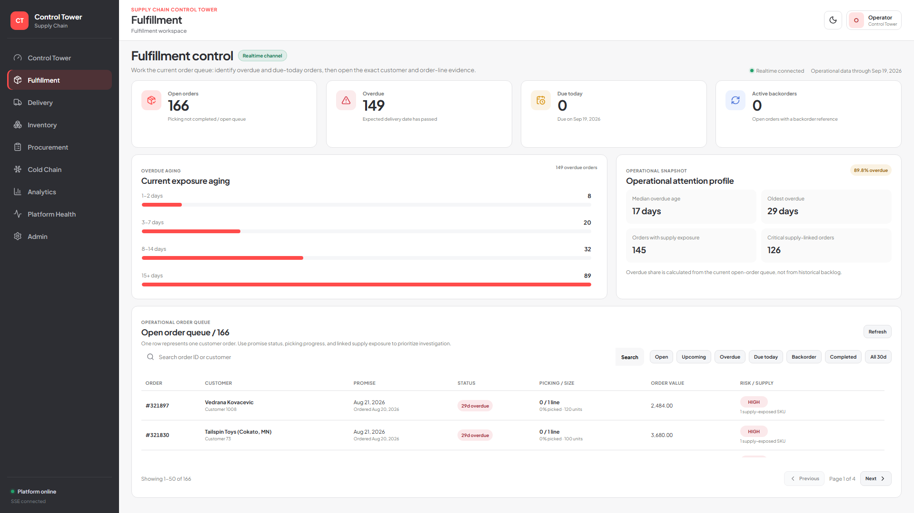</a></td>
<td width="33%"><strong>Delivery</strong><br/><a href="docs/demo/06-delivery-overview.png">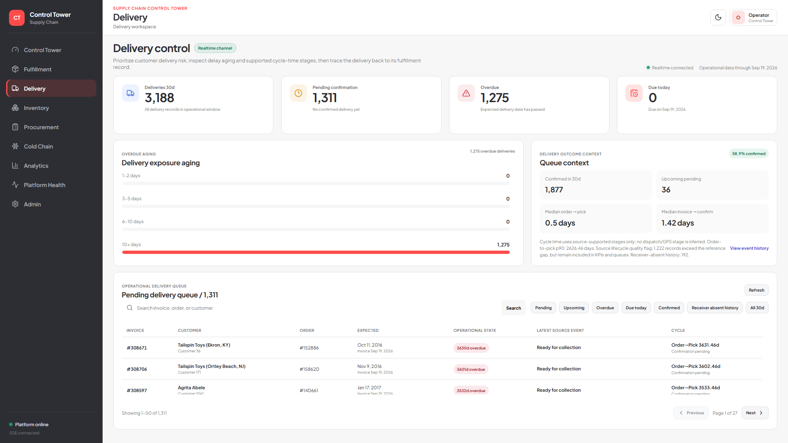</a></td>
<td width="33%"><strong>Inventory</strong><br/><a href="docs/demo/08-inventory-overview.png">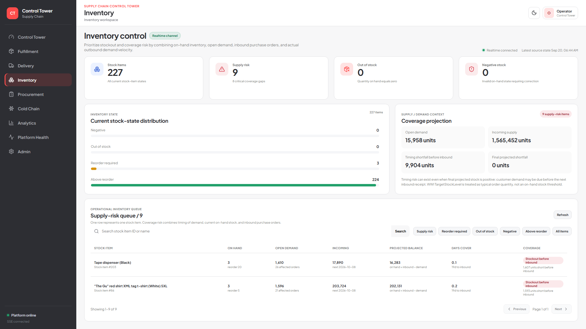</a></td>
</tr>
<tr>
<td width="33%"><strong>Procurement</strong><br/><a href="docs/demo/10-procurement-overview.png">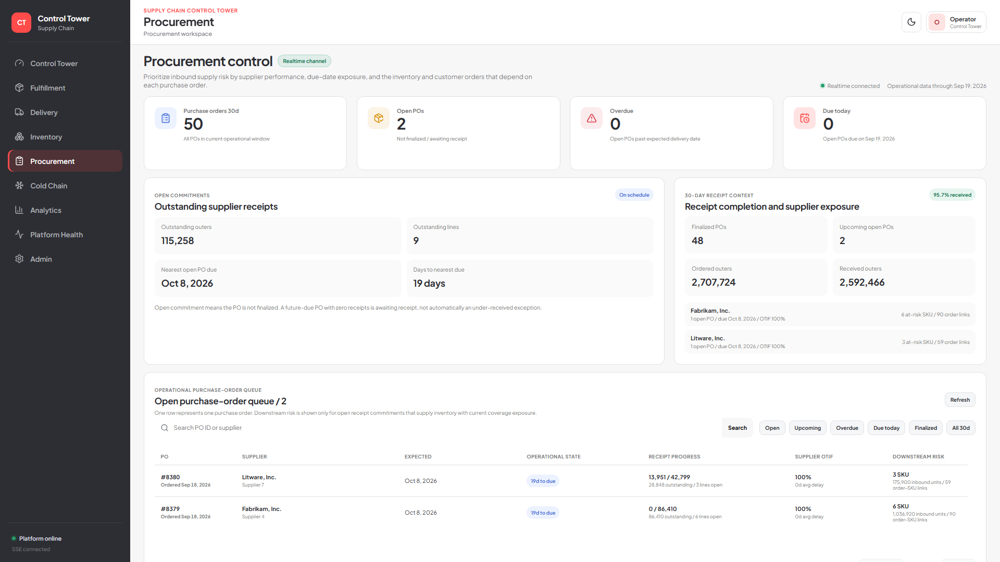</a></td>
<td width="33%"><strong>Cold Chain</strong><br/><a href="docs/demo/13-cold-chain-overview.png">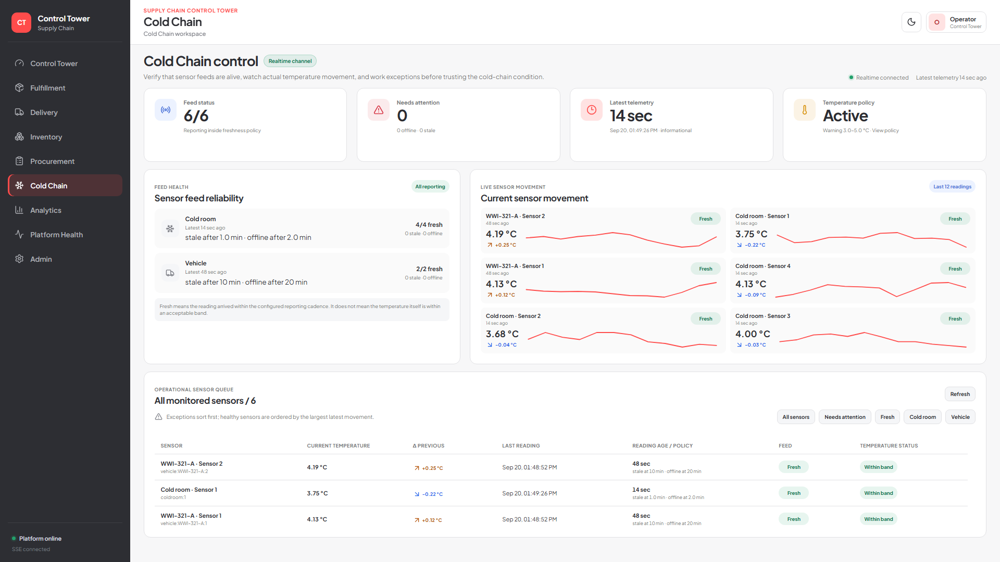</a></td>
<td width="33%"><strong>Analytics</strong><br/><a href="docs/demo/15-analytics-overview.png">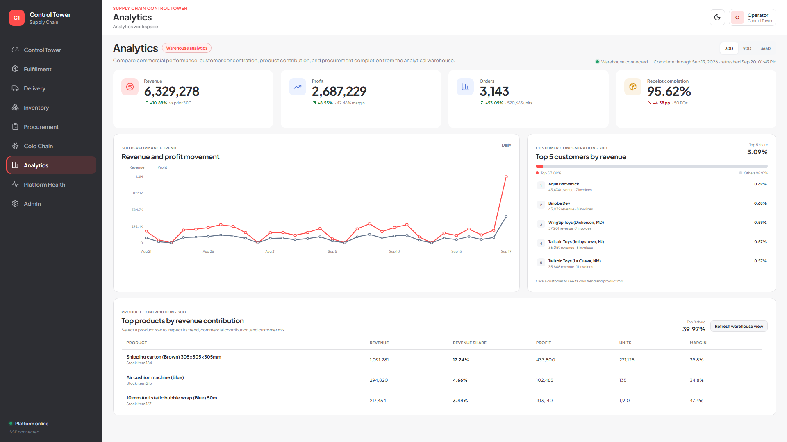</a></td>
</tr>
<tr>
<td width="33%"><strong>Platform Health</strong><br/><a href="docs/demo/18-platform-health-overview.png">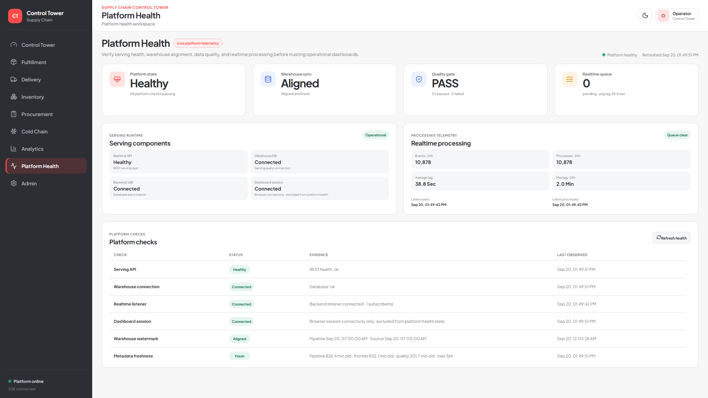</a></td>
<td width="33%"><strong>Admin</strong><br/><a href="docs/demo/19-admin-overview.png">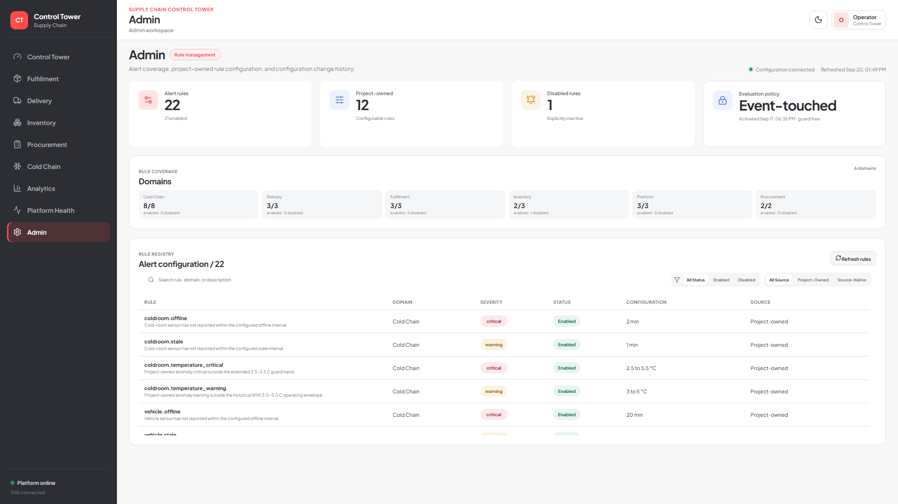</a></td>
<td width="33%"><strong>Active Exceptions</strong><br/><a href="docs/demo/02-control-tower-exceptions.png">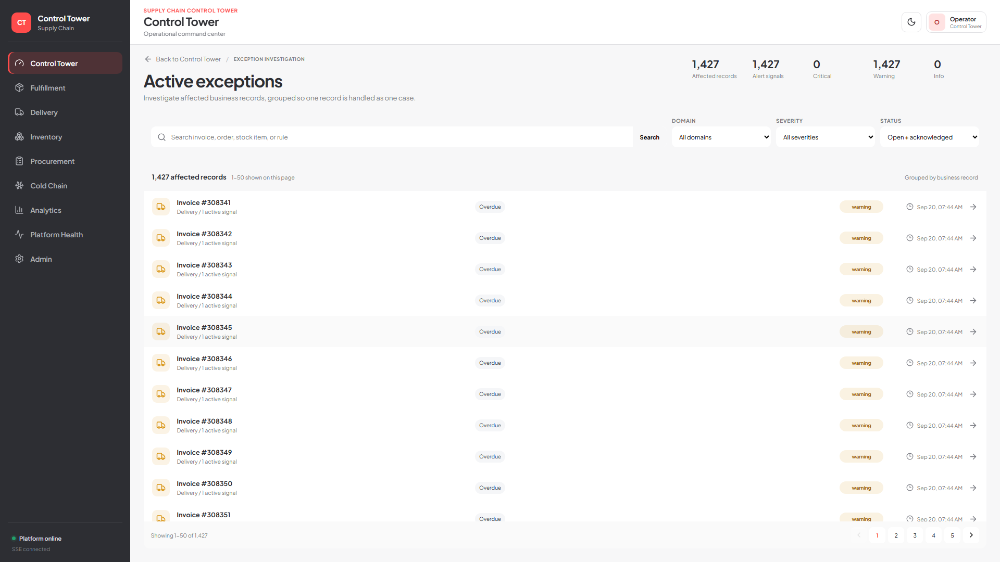</a></td>
</tr>
</table>

### Interaction depth

Operational rows and cases open investigation and drill-down states rather than stopping at summary cards.

<table>
<tr>
<td width="33%"><strong>Operational case</strong><br/><a href="docs/demo/03-control-tower-exception-detail.png">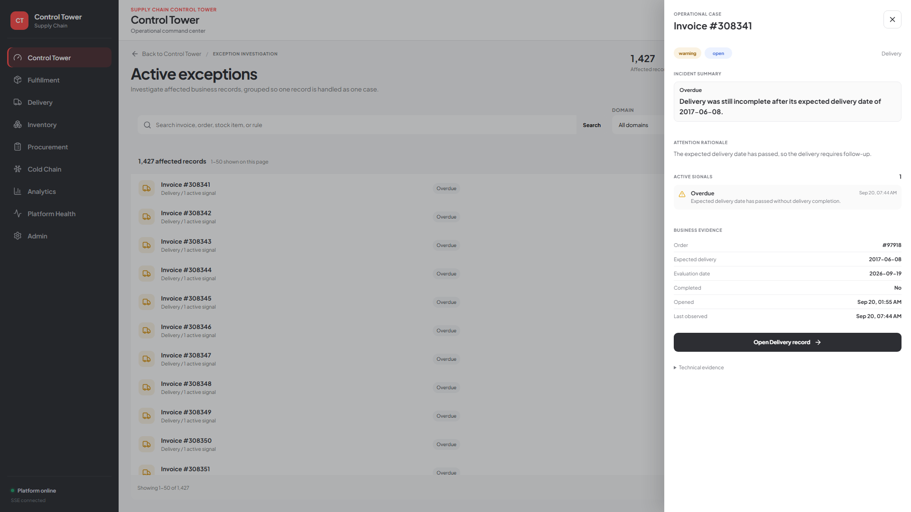</a></td>
<td width="33%"><strong>Supply-risk trace</strong><br/><a href="docs/demo/09-inventory-detail.png">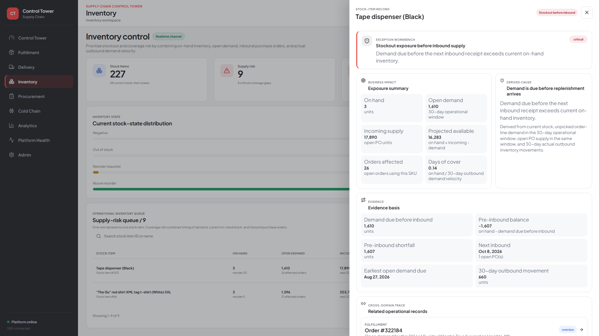</a></td>
<td width="33%"><strong>Analytics drill-down</strong><br/><a href="docs/demo/16-analytics-product-drilldown.png">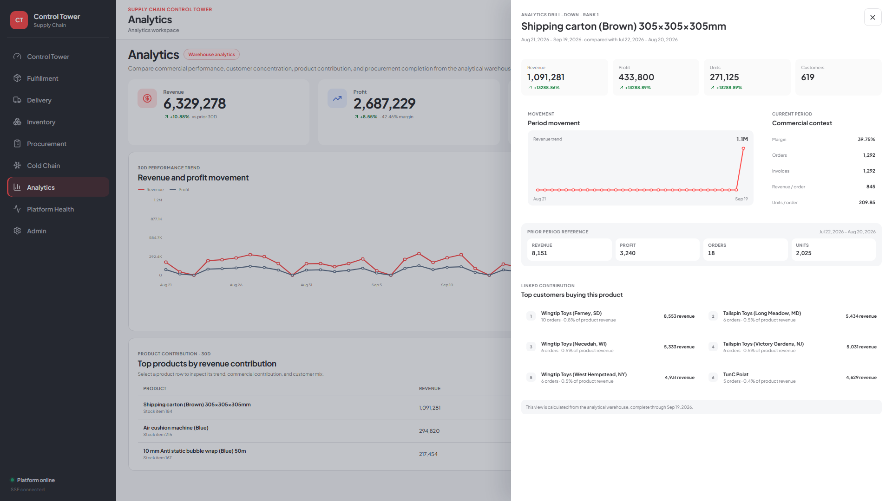</a></td>
</tr>
</table>

**Full 20-screen walkthrough:** [overview + clicked detail states for every serving area](docs/demo/README.md)

## What this project implements

| Area | Implementation |
|---|---|
| Source system | Microsoft SQL Server 2022 + WideWorldImporters OLTP |
| Orchestration | Apache Airflow 3.3.1 |
| Analytical storage | PostgreSQL 17 |
| Transformation | dbt Core |
| Incremental processing | Source frontier + production watermark |
| Operational events | SQL Server Service Broker |
| Realtime serving | Python API + Server-Sent Events |
| Data quality | dbt tests + source/staging/core/telemetry reconciliation |
| Recovery | Restart, retry/replay, idempotent reruns |
| Backfill | Historical windows isolated from the production watermark |
| Frontend | React/Vite operational dashboard |

## Architecture

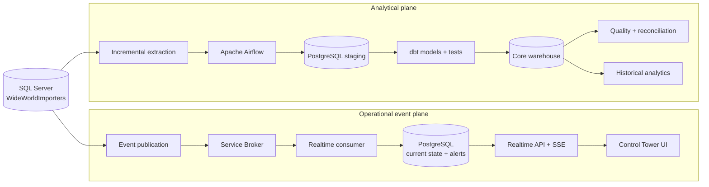

The operational event plane serves current operational state and exceptions. The analytical plane serves historical analysis, reconciliation, and business marts.

## Business serving layer

- **Control Tower** - cross-domain operational status and active exceptions
- **Fulfillment** - order queue, overdue exposure, backorders, and related records
- **Delivery** - pending/overdue/confirmed delivery state, aging, and event history
- **Inventory** - projected balance, coverage, inbound timing, and supply-risk items
- **Procurement** - open inbound commitments, receipt status, and downstream exposure
- **Cold Chain** - cold-room and vehicle sensor status, freshness, movement, and history
- **Analytics** - revenue, profit, orders, receipt completion, and customer/product drill-downs
- **Platform Health** - watermark, source frontier, freshness, quality, and realtime status
- **Admin** - persisted operational rule configuration

## Validation evidence

Recorded validation includes:

- frontend production build
- application navigation and interaction checks
- 1920x1080 and 2560x1440 layout checks
- **116 / 116 dbt tests passing**
- source-to-staging and staging-to-core reconciliation
- raw-to-aggregate telemetry reconciliation
- controlled Docker stop/start recovery
- post-restart manual and scheduled Airflow runs
- clean-clone bootstrap on fresh Docker volumes
- full quality gate with zero hard failures
- zero event-transport backlog after clean-clone validation

- [Runtime validation](docs/evidence/runtime/runtime-validation-2026-09-20.md)

## Source data

The frozen source baseline through **2026-09-15** contains approximately:

- **93.3M** raw user-table rows
- **323K** sales orders
- **308K** invoices
- **1.02M** stock-item transactions
- **8.3K** purchase orders
- **89M** telemetry rows
- **98** foreign-key relationships

Architecture decision record: [docs/architecture/business-architecture-design-gate.md](docs/architecture/business-architecture-design-gate.md)

## Run locally

Prerequisites:

- Docker Desktop / Docker Compose
- PowerShell
- Node.js + npm

Create local configuration:

```powershell
Copy-Item .env.example .env
```

### Local credentials and Airflow login

Database/service credentials are configured locally in `.env` and are not committed to Git. Set local values for:

```text
MSSQL_SA_PASSWORD
DWH_PASSWORD
AIRFLOW_DB_PASSWORD
WWI_SOURCE_PASSWORD
WWI_EVENT_PASSWORD
```

Generate the Airflow Fernet key:

```powershell
python -c "import base64,secrets; print(base64.urlsafe_b64encode(secrets.token_bytes(32)).decode())"
```

Generate separate random values for `AIRFLOW_API_SECRET_KEY` and `AIRFLOW_JWT_SECRET`:

```powershell
python -c "import secrets; print(secrets.token_urlsafe(48))"
```

Run that command twice so the API and JWT secrets use different values.

The Airflow UI username comes from `AIRFLOW_ADMIN_USERNAME` in `.env` (the example value is `admin`). Airflow SimpleAuthManager generates the UI password on first startup. After the Airflow API server is running, read the locally generated password with:

```powershell
docker compose exec -T airflow-api-server cat /opt/airflow/simple_auth_manager_passwords.json.generated
```

### Public source-only path

The official Microsoft WideWorldImporters source can be downloaded and restored directly from the public release:

```powershell
powershell -ExecutionPolicy Bypass -File scripts/bootstrap/download-wwi.ps1
powershell -ExecutionPolicy Bypass -File scripts/bootstrap/bootstrap-source.ps1
```

This path validates the source runtime only; it does not recreate the final 2026 portfolio state or provision the complete serving platform.

### Full portfolio runtime

The final portfolio runtime uses the checksum-pinned frozen baseline:

```text
data/baselines/full-master/wwi-full-master-2026-09-15.bak
```

The baseline is intentionally excluded from Git history because of its size. The full bootstrap downloads it automatically from the project's `v1.0-data-baseline` GitHub Release when it is not already present, then validates its size, SQL Server backup signature, and SHA-256 before restore.

Run:

```powershell
powershell -ExecutionPolicy Bypass -File scripts/bootstrap/bootstrap-platform.ps1
```

The baseline download is approximately **1.55 GiB** on a fresh clone.

Start the frontend separately:

```powershell
Set-Location frontend
npm ci
npm run dev
```

Local endpoints:

```text
Frontend     http://127.0.0.1:5173
Realtime API http://127.0.0.1:18000
Airflow      http://127.0.0.1:28080
```

## Repository map

```text
.
|-- airflow/dags/          # orchestration DAGs
|-- dbt/                   # analytical models and tests
|-- frontend/              # Control Tower UI
|-- src/                   # ingestion, realtime, quality, simulation
|-- sql/                   # SQL Server and PostgreSQL contracts
|-- scripts/               # bootstrap and testing utilities
|-- docs/
|   |-- architecture/      # architecture contracts
|   |-- demo/              # 20-screen product walkthrough
|   |-- evidence/          # engineering evidence by capability
|   `-- source-audit/      # source audit and simulation evidence
|-- tests/
|-- docker-compose.yml
`-- README.md
```

## Documentation

- [20-screen product walkthrough](docs/demo/README.md)
- [Detailed project notes](docs/PROJECT_DETAILS.md)
- [Engineering notes](docs/ENGINEERING_NOTES.md)
- [Architecture design gate](docs/architecture/business-architecture-design-gate.md)
- [Warehouse model contract](docs/architecture/warehouse-model-contract.md)
- [Data-quality evidence](docs/evidence/data-quality/final-freshness-semantics.md)
- [Serving evidence](docs/evidence/serving/serving-validation.md)
- [Runtime validation](docs/evidence/runtime/runtime-validation-2026-09-20.md)

## Author

**Victor**
