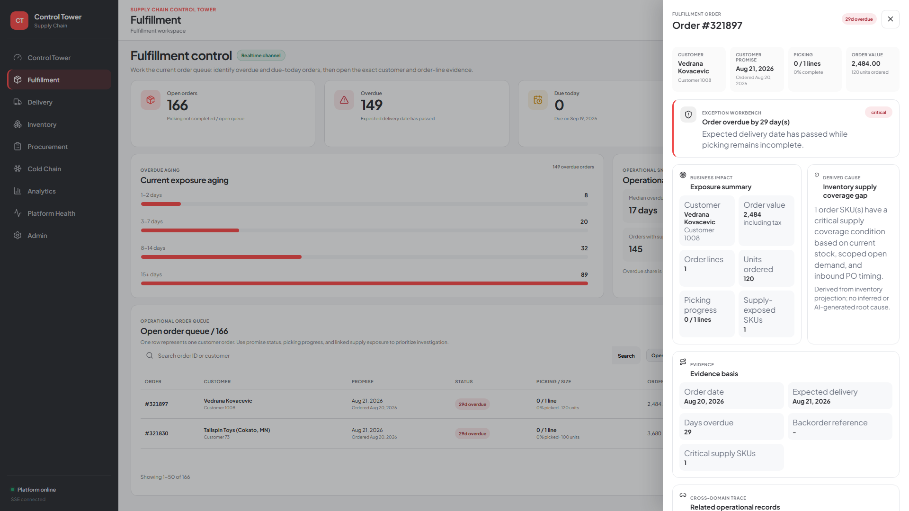
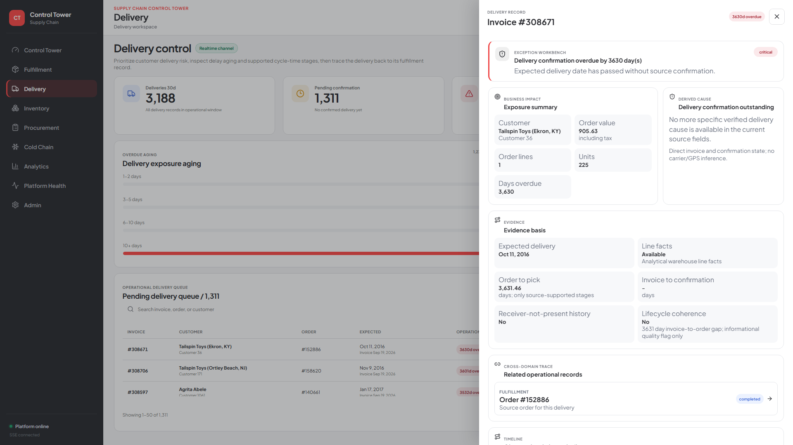
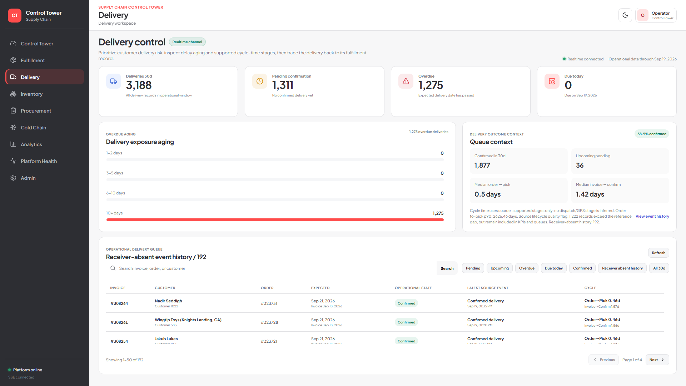
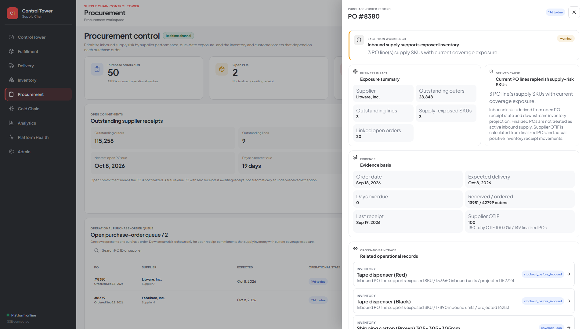
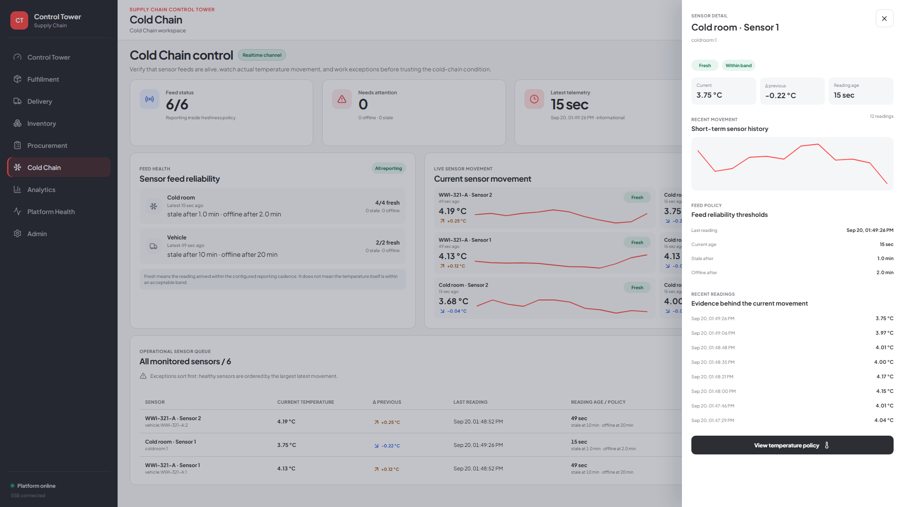
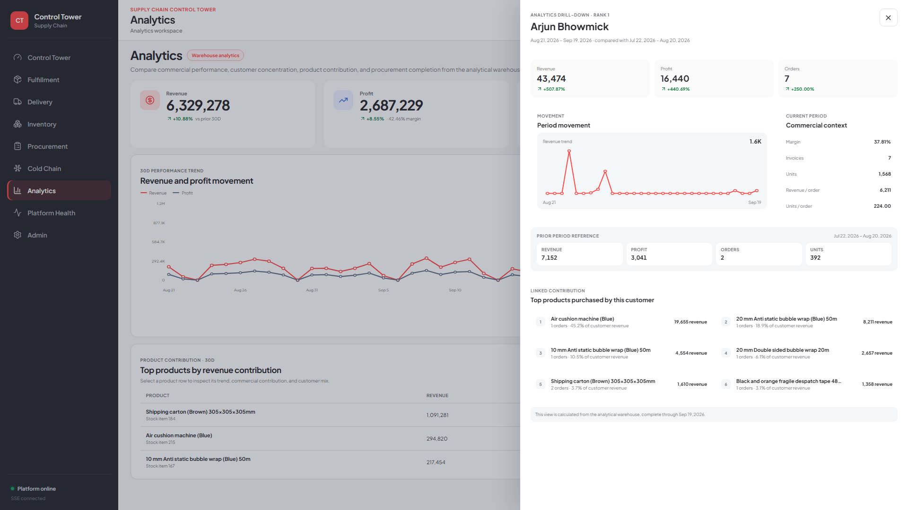
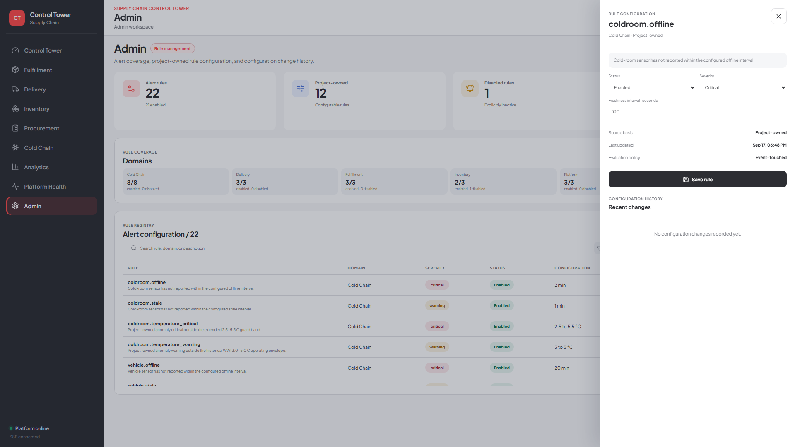

# Product Tour

This is the final v1.0 serving layer captured from the **live local application**, not from static mockups. Values may change as the project-owned source simulator advances, but the interaction flow remains the same.

The operator path is intentionally consistent:

```text
exception -> business impact -> evidence -> derived cause -> related records -> timeline / action
```

## Control Tower

The landing page summarizes current cross-domain exposure. From here an operator can jump into a domain or open the full exception workspace.

<table>
<tr>
<td width="50%"><strong>Operational overview</strong><br/><a href="01-control-tower-overview.png"></a></td>
<td width="50%"><strong>Active exception workspace</strong><br/><a href="02-control-tower-exceptions.png"></a></td>
</tr>
</table>

Clicking a case opens the operational-case drawer with incident summary, rationale, active signals, business evidence, and technical evidence.

<a href="03-control-tower-exception-detail.png"></a>

## Fulfillment

Fulfillment shows the current order queue, overdue aging, backorders, due-today exposure, and completion state. Clicking an order opens the Exception Workbench for that order.

<table>
<tr>
<td width="50%"><strong>Fulfillment overview</strong><br/><a href="04-fulfillment-overview.png"></a></td>
<td width="50%"><strong>Order exception detail</strong><br/><a href="05-fulfillment-detail.png"></a></td>
</tr>
</table>

The detail view connects the customer promise to supply exposure, evidence, inventory records, purchase orders, milestones, and order-line facts.

## Delivery

Delivery focuses on pending confirmation, overdue aging, completed deliveries, and source delivery-event context.

<table>
<tr>
<td width="50%"><strong>Delivery overview</strong><br/><a href="06-delivery-overview.png"></a></td>
<td width="50%"><strong>Delivery exception detail</strong><br/><a href="07-delivery-detail.png"></a></td>
</tr>
<tr>
<td colspan="2"><strong>Delivery event history</strong><br/><a href="12-delivery-event-history.png"></a></td>
</tr>
</table>

The detail state traces the invoice back to its source order and separates current delivery status from historical delivery-attempt evidence.

## Inventory

Inventory is not a raw stock dump. The serving layer projects operational exposure from current stock, scoped open demand, inbound supply, and timing.

<table>
<tr>
<td width="50%"><strong>Inventory overview</strong><br/><a href="08-inventory-overview.png"></a></td>
<td width="50%"><strong>Supply-risk SKU detail</strong><br/><a href="09-inventory-detail.png"></a></td>
</tr>
</table>

A selected SKU exposes demand due before inbound, pre-inbound shortfall, next replenishment, linked fulfillment orders, linked purchase orders, and the supporting timeline.

## Procurement

Procurement connects open inbound supply to the inventory and customer orders that depend on it.

<table>
<tr>
<td width="50%"><strong>Procurement overview</strong><br/><a href="10-procurement-overview.png"></a></td>
<td width="50%"><strong>Purchase-order detail</strong><br/><a href="11-procurement-detail.png"></a></td>
</tr>
</table>

The purchase-order detail shows supplier, expected receipt, outstanding quantities, receipt status, exposed SKUs, and downstream order links.

## Cold Chain

Cold Chain serves source-backed cold-room and vehicle sensor status, freshness, recent movement, and short-term history.

<table>
<tr>
<td width="50%"><strong>Sensor overview</strong><br/><a href="13-cold-chain-overview.png"></a></td>
<td width="50%"><strong>Sensor history and evidence</strong><br/><a href="14-cold-chain-sensor-detail.png"></a></td>
</tr>
</table>

Selecting a sensor opens its short-term history, freshness thresholds, current movement, and evidence behind the displayed state.

## Analytics

Analytics is served from the analytical warehouse rather than the realtime operational plane. The page supports period comparison plus Customer and Product drill-downs.

<table>
<tr>
<td width="50%"><strong>Analytics overview</strong><br/><a href="15-analytics-overview.png"></a></td>
<td width="50%"><strong>Product drill-down</strong><br/><a href="16-analytics-product-drilldown.png"></a></td>
</tr>
<tr>
<td colspan="2"><strong>Customer drill-down</strong><br/><a href="17-analytics-customer-drilldown.png"></a></td>
</tr>
</table>

Drill-downs retain the selected period and add movement, prior-period context, commercial metrics, and linked contribution.

## Platform Health

Platform Health makes the data platform itself observable to the operator: analytical watermark, source frontier, component health, realtime processing, and persisted platform checks.

<a href="18-platform-health-overview.png"></a>

This page is intentionally status-oriented; there is no artificial detail drawer where the product does not need one.

## Admin

Admin exposes the alert catalog and separates source-native rules from project-owned configurable rules.

<table>
<tr>
<td width="50%"><strong>Alert configuration overview</strong><br/><a href="19-admin-overview.png"></a></td>
<td width="50%"><strong>Rule configuration detail</strong><br/><a href="20-admin-rule-detail.png"></a></td>
</tr>
</table>

Selecting a rule opens its status, severity, configurable parameters, source basis, evaluation policy, and configuration history.

## What is behind the UI

These screens are backed by the final local stack and were validated with:

- app-wide navigation and interaction QA
- source-to-serving numerical reconciliation
- 1920x1080 and 2560x1440 layout checks
- **116 / 116 dbt tests passing**
- controlled Docker stop/start recovery
- post-restart manual and scheduled Airflow runs
- clean-clone reproduction on fresh Docker volumes
- full quality gate with **0 hard failures**
- zero event transport backlog after the clean-clone proof

For engineering evidence, see the [runtime validation](../evidence/runtime/runtime-validation-2026-09-20.md) and [clean-clone reproduction](../evidence/runtime/reproducibility.md).
